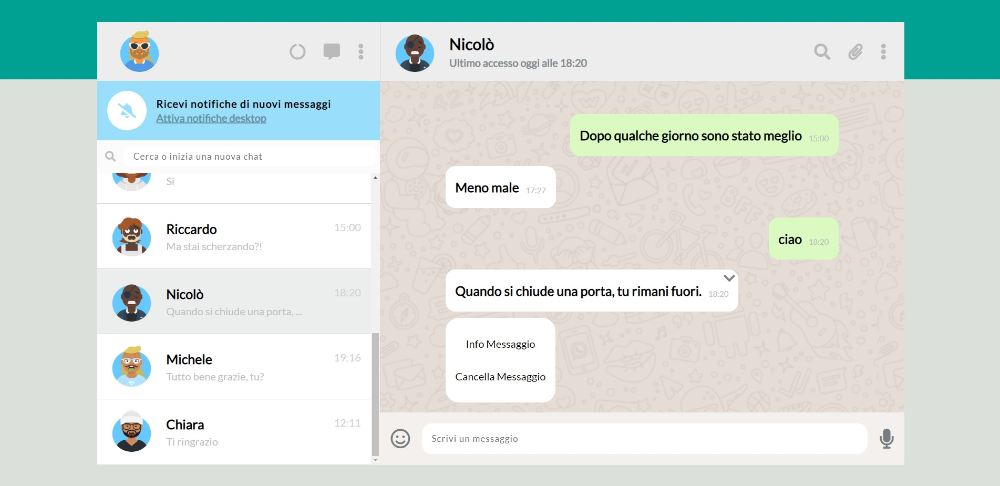
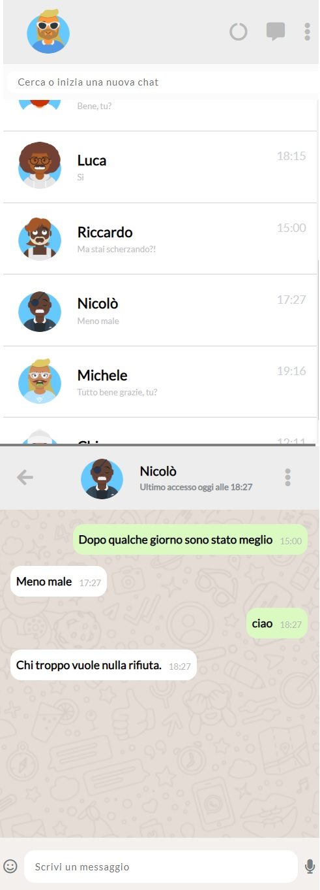

# Js-html-css-boolzap
This is a replica of WhatsApp Web. You can send messages to different contacts and after one second he/she will reply with a random funny message.   

On the left, you can see the last message as well as the time when it was sent/received. On top, the last access of the contact and you have the option to delete a message. The site supports mobile, tablet, and desktop sizes.  

HTML, CSS, JavaScript, jQuery, Handlebars.

***
### [Live Website](https://gianluigivitale.github.io/js-html-css-boolzap/)
***
### Preview-lg:

### Preview-xs:

